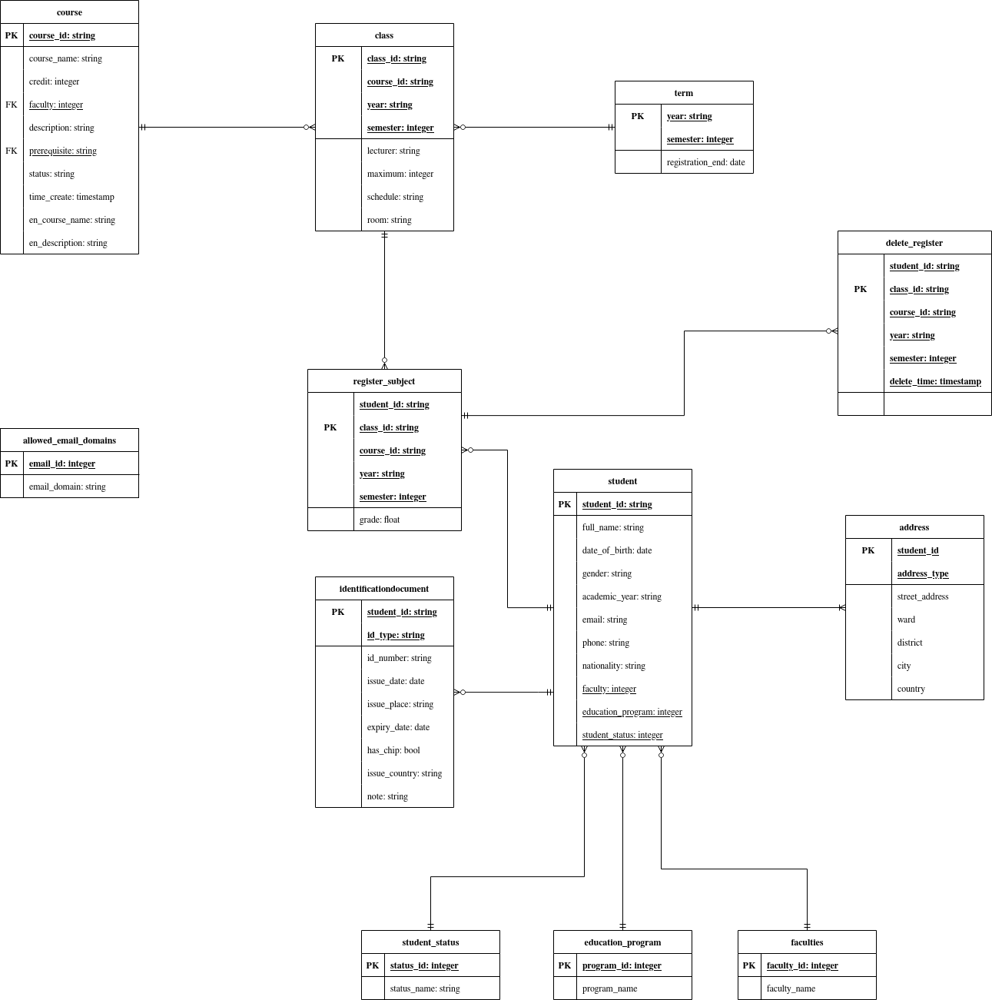

# 📘 Tài liệu Hướng dẫn Lập trình viên - Sơ đồ CSDL Hệ thống Đăng ký Môn học

Tài liệu này nhằm cung cấp cái nhìn tổng quan về cấu trúc cơ sở dữ liệu được sử dụng trong hệ thống quản lý đăng ký môn học dành cho sinh viên. Phù hợp với lập trình viên backend, kỹ sư dữ liệu và những người phát triển hệ thống liên quan.

---

## 🧩 Tổng quan

Cơ sở dữ liệu có 12 quan hệ bao gồm: student, course, class, register_subject, allowed_email_domains, term, delete_register, address, identificationdocument, student_status, education_program, faculties.

---

## 🔗 Quan hệ giữa các bảng

- `student` có quan hệ với `identificationdocument`, `address`, `register_subject`, `faculties`, `education_program`, `student_status`
- `course` có quan hệ với `class`, `faculties`
- `class` có quan hệ với `register_subject`, `term`
- `register_subject` có quan hệ với `delete_register`
- `allowed_email_domains` là bảng tham chiếu cho xác thực email

---

## 🧾 Mô tả bảng

### 🧍‍♂️ `student`
- **Mô tả**: Lưu thông tin cá nhân và học tập của sinh viên.
- **Thuộc tính chính**:
  - `student_id` (PK)
  - `full_name`, `date_of_birth`, `gender`, `email`, `phone_string`, `nationality`
  - `academic_year`, `faculty_id`, `education_program`, `student_status`
- **Quan hệ**:
  - FK đến `faculties`, `education_program`, `student_status`

---

### 🪪 `identificationdocument`
- **Mô tả**: Lưu thông tin giấy tờ tùy thân của sinh viên.
- **Thuộc tính**:
  - `student_id`, `id_type`, `id_number`, `issue_date`, `expiry_date`, `issue_place`, `issue_country`, `has_chip`, `note`

---

### 🏠 `address`
- **Mô tả**: Lưu địa chỉ của sinh viên (có thể có nhiều loại địa chỉ).
- **Thuộc tính**:
  - `student_id`, `address_type`, `street_address`, `ward`, `district`, `city`, `country`

---

### 📊 `student_status`
- **Mô tả**: Trạng thái học tập của sinh viên (đang học, tạm dừng, đã tốt nghiệp,...).
- **Thuộc tính**:
  - `status_id` (PK), `status_name`

---

### 🎓 `education_program`
- **Mô tả**: Thông tin chương trình đào tạo mà sinh viên theo học.
- **Thuộc tính**:
  - `program_id` (PK), `program_name`

---

### 🏫 `faculties`
- **Mô tả**: Thông tin về các khoa của trường.
- **Thuộc tính**:
  - `faculty_id` (PK), `faculty_name`

---

### 📚 `course`
- **Mô tả**: Thông tin về các môn học.
- **Thuộc tính**:
  - `course_id` (PK), `course_name`, `credit`, `description`, `prerequisite`, `status`, `faculty_id`, `time_create`, `en_course_name`, `en_description`

---

### 🏢 `class`
- **Mô tả**: Đại diện cho các lớp mở theo từng học kỳ.
- **Thuộc tính**:
  - `class_id` (PK), `course_id`, `year`, `semester`, `lecturer`, `maximum`, `schedule`, `room`
- **Quan hệ**:
  - FK đến `course`, `term`

---

### 🗓️ `term`
- **Mô tả**: Đại diện cho kỳ học (học kỳ - năm).
- **Thuộc tính**:
  - `year`, `semester` (PK), `registration_end_date`

---

### ✅ `register_subject`
- **Mô tả**: Ghi nhận thông tin đăng ký môn học của sinh viên.
- **Thuộc tính**:
  - `student_id`, `class_id`, `course_id`, `year`, `semester`, `grade`
- **Quan hệ**:
  - FK đến `student`, `class`, `course`

---

### 🗑️ `delete_register`
- **Mô tả**: Lưu trữ các bản ghi đã bị sinh viên hủy đăng ký.
- **Thuộc tính**:
  - `student_id`, `class_id`, `course_id`, `year`, `semester`, `delete_time`

---

### 📧 `allowed_email_domains`
- **Mô tả**: Danh sách các tên miền email hợp lệ cho tài khoản sinh viên.
- **Thuộc tính**:
  - `email_id` (PK), `email_domain`

---

## 🧠 Lưu ý triển khai

- **Khóa chính** được đặt rõ ràng trong mỗi bảng.
- **Khóa ngoại** cần được quản lý chặt để đảm bảo toàn vẹn dữ liệu.
- **Thời gian và trạng thái** như `registration_end_date`, `delete_time`, `status` rất quan trọng cho logic nghiệp vụ.
- Bảng `delete_register` hữu ích cho việc thống kê lịch sử hành vi của sinh viên.
- Hệ thống hỗ trợ đa ngôn ngữ qua các trường như `en_course_name`, `en_description`.

---

## ✅ Gợi ý kiểm tra trước khi triển khai

- Kiểm tra toàn vẹn dữ liệu giữa các bảng có liên kết.
- Đảm bảo sử dụng index trên các cặp khóa chính và khóa ngoại để tối ưu hiệu suất truy vấn.
- Xây dựng view hoặc stored procedures để hỗ trợ truy vấn phức tạp như lịch sử học tập, điểm trung bình...

---

> 🛠️ Đừng quên cập nhật tài liệu này khi có sự thay đổi trong cơ sở dữ liệu để đảm bảo đồng bộ giữa tài liệu và hệ thống thực tế.

